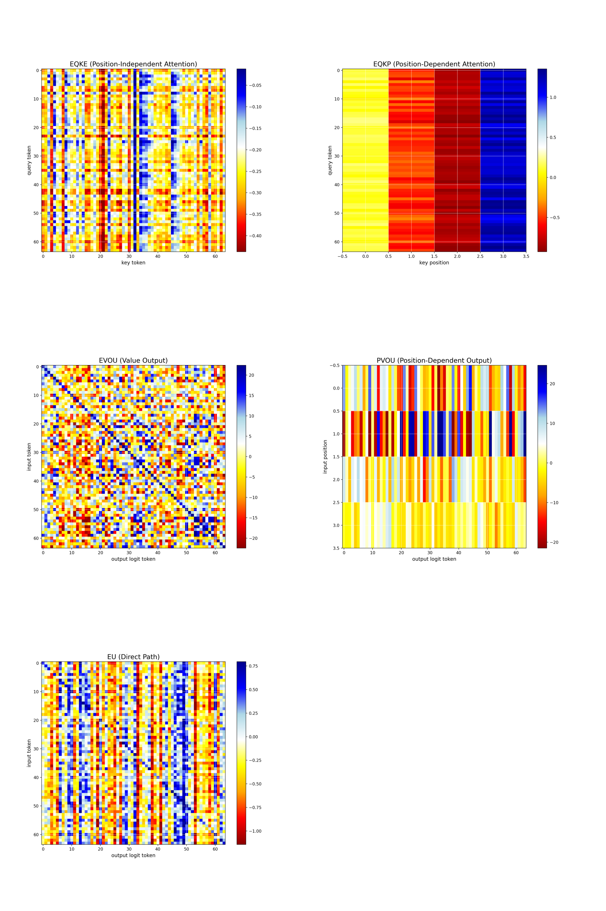

- [x] Write circuit decompositions
- [x] Make heatmaps
- [ ] Figure out where to mask
- [ ] SVD decomposition (section 3.1)
- [ ] Bug: EQKE is 0.1x expected
- [ ] Bug: EQKP is 10x expected
- [ ] Bug: EU missing "copying" diagonal

### Circuit decomposition

